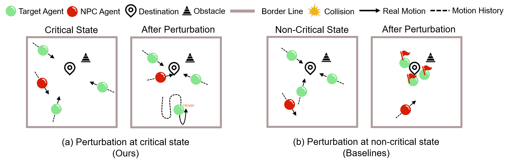
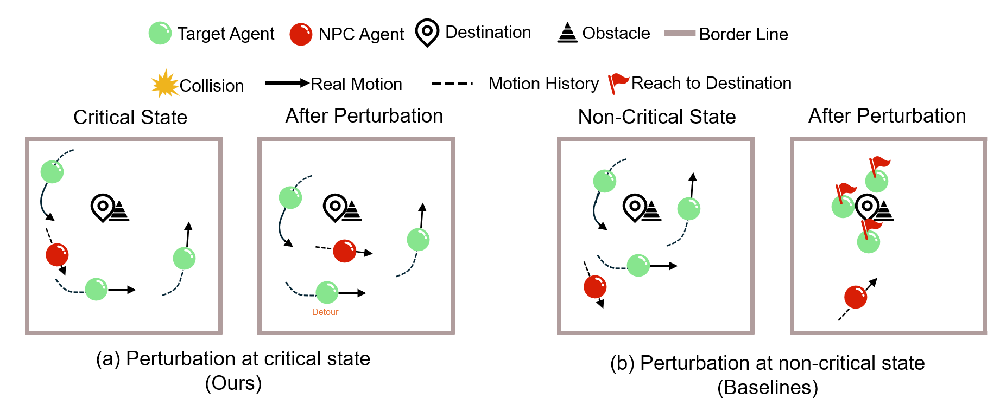

# Qualitative Analysis
We further improve the qualitative analysis of the results combined with the principles of methods. Specifically, we analyze why our approach can generate some failure scenarios and the baseline method does not. 

Details are shown below to analyze the results:

As shown in Figure (a), our approach recognizes the current state as the critical state, i.e., the target agent is moving towards the destination, and the NPC is at a suitable distance from the topmost target agent. The NPC is perturbed to turn and run towards the target agent, and finally collides with it.

In the contrast, baselines select a non-critical state for perturbation, as shown in Figure (b). Because the critical opportunity is missed, after the perturbation, the NPC cannot interfere with the target agent in time, and finally the target agent can reach the destination.

As shown in Figure (a), the critical state is: the target agent moves towards the destination, and NPC is at its tail and close to it. Our method recognizes this critical state and causes the NPC to start chasing, creating a failure scenario.

In contrast, the baseline selects non-critical states for perturbation, as shown in Figure (b). Due to ignoring critical state, after the perturbation, the NPC has been unable to catch up with the target agent, so there is no failure scenario.

As shown in Figure (a), the critical state is: the target agents move towards the destination, and the NPC is also near the destination. Our approach recognizes this critical state and causes the NPC to move toward destination, causing the agent to start hovering and eventually generating a failure scenario.

In contrast, the baseline selects non-critical states for perturbation, as shown in Figure (b). Due to ignoring critical state, after the perturbation, NPC can no longer interfere with the behavior of the target agent, so there is no failure scenario.

As shown in Figure (a), the critical state is: since the obstacle is close to the destination, the agents are detouring. Our approach recognizes this critical state and causes NPC to move closer to the destination, also detouring, causing agents to not move closer to the destination, resulting in a failure scenario.

In contrast, the baseline selects non-critical states for perturbation, as shown in Figure (b). Since the critical state is ignored, after the perturbation, the target agents already know how to reach the destination. At this point, the NPC can no longer interfere with the target agent's behavior, so there is no failure scenario.
