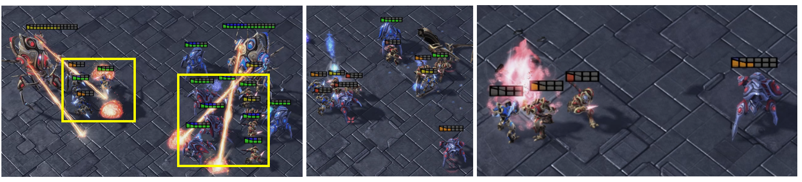
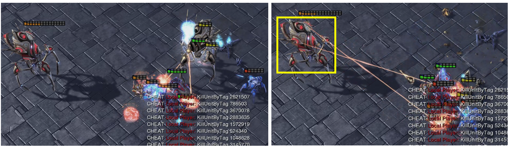
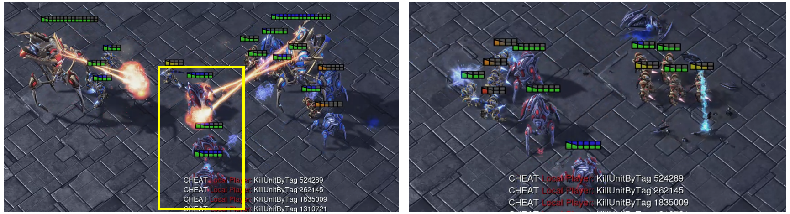
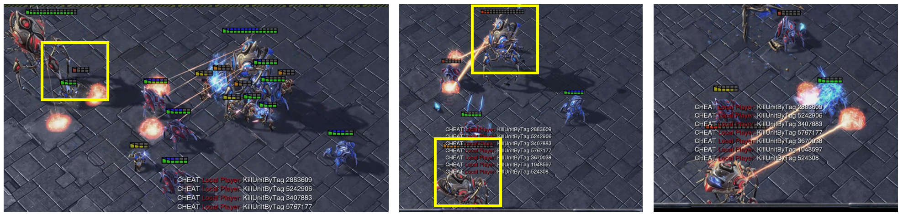
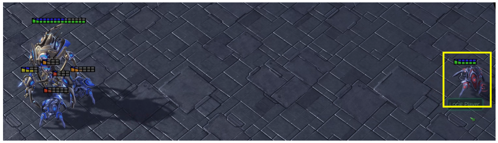

# Unique failure patterns of Competitive Task

We summarize the failure scenarios in the competitive task into two categories: target MAS loses (F3) and target MAS draws (F4).

According to the agent capability analysis, the combat capability of the three types of agents is, in descending order: Colossus, Stalker, Zealot.
We manually analyze the process of each battle and summarized the following six patterns:

**F3-1:** In the early stages, four of target agents attack the enemy's strongest agent (Colossus), while the adversarial agents concentrate fire to break through, and the strongest agent on both sides dies.
% Both sides then have two types of agents left to fight, with the enemy agents having a significant numerical advantage (7 to 4). Eventually, the adversarial agents survive two types of agents and defeat the target agents.

**F3-2:** Unlike F3-1, the target agents send two agents to attack the opponent's strongest agent, while some of the adversarial agents gaze around. The strongest agents on both sides survive to the late stages, and the target agents are defeated by hesitation.

**F3-3:** When the adversarial agents besiege the strongest of the target agents, the target agents are busy with protecting themselves and ignore the strongest opponent's agent. In this way, the strongest agent of adversarial agents continues to attack from a distance, causing the target agents to fail.

**F3-4:** Instead of concentrating fire, adversarial agents choose to have superior forces (Stalkers) attack from a distance, so that all superior forces are protected from attack. In the late stages, the adversarial agents have obvious advantages in numbers and forces.

**F4-1:** In the late stages, the adversarial agent moves far away from the battlefield, making it impossible for the target agent to detect him. Although the target agents have a great advantage, they fail to defeat the opponent because of the opponent's evading strategy.

**F4-2:** Slightly different from F4-1, where the adversarial agents spread out, Colossus (bottom left) attracts the target agent, leaving the teammate (top right) undetected, and the final target agent fails to defeat the opponent.

